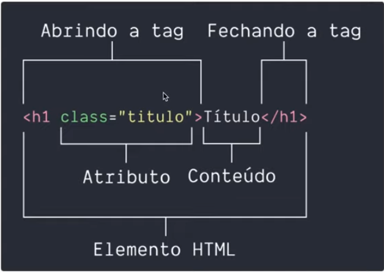
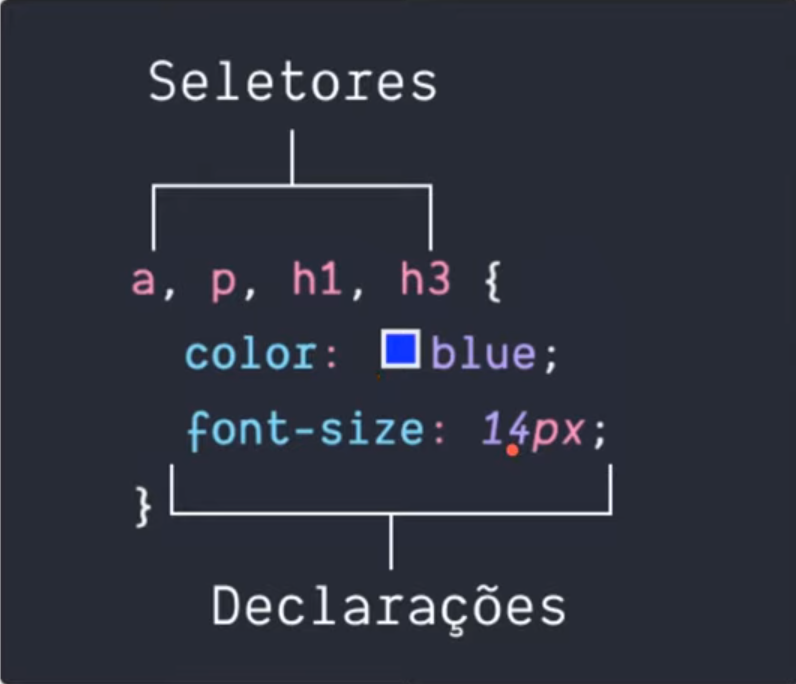
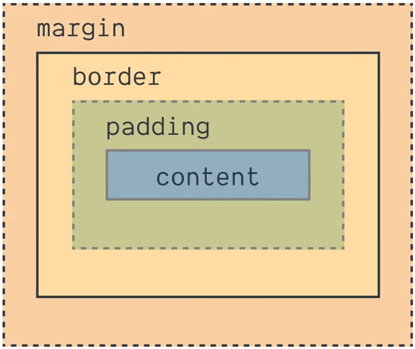

# Anotações do curso de HTML5 e CSS3

HTML foi criado por Tim Berners-Lee:
 - HTML 1 - 1991
 - HTML 2 - 1995
 - HTML 3 - 1997
 - HTML 4 - 1997
 - HTML 5 - 2014

## Elementos de um HTML



## Estrutura básica de um HTML
```html
<!DOCTYPE html>
<html>
    <head>
        <meta>
        <title></title>
    </head>
    <body>
    
    </body>
</html>
```
Por ser uma linguagem de marcação de hipertextos, essa marcação é realizada através de tags (etiquetas). A descrição das tags é facilmente encontrada na web.

## Semântica
Durante muito tempo o elemento padrão para definição semântica foi a tag **div**.

A partir de 2014, HTML 5, surgiram novos elementos semânticos, como:
- \<section\>
- \<aside\>
- \<header\>
- \<footer\>
- \<article\>

## Demais tags

- \<p\> -> parágrafo
- \<a\> -> link

As tags podem possuir parâmetros/opções, conforme o exemplo abaixo da tag de link:
```html
    <a href="http://link">Título do link</a>
```

## CSS3

Usado para estilizar o HTML. É usado para criar regras de estilo para elementos ou grupo de elementos. 



Há vários tipos de seletores como:
- id
- class

Um id é único, para um único elemento
Uma class representa um conjunto de elementos, podendo ser utilizado mais de uma vez em uma página.

Na escrita de um estilo css, um id é representado por "#" e uma class por ".". Exemplo:

```css
#title, .subtitle, .postitle {
    color: blue;
}

.postitle {
    font-size: 16px;
    font-style: italic;
}
```

### Box model em um HTML


## Repositório do curso

[Repositório Github do código do curso](https://github.com/gutobrutus/dio-html5-css3)